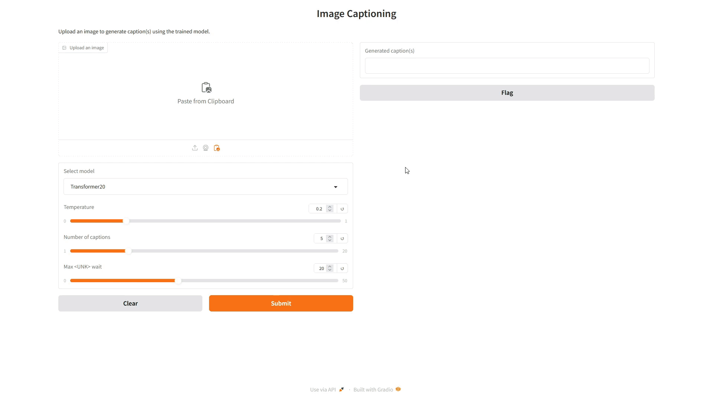

# Image captioning using Deep Learning approaches

## Introduction



Image captioning integrates computer vision and natural language processing, transforming visual content into meaningful text. 

In this project, we implement three image captioning methods:
- **Encoder-Decoder Framework**: A straightforward and effective baseline for generating captions.
- **CNN-LSTM with Attention**: Improves caption quality by focusing on important regions within an image.
- **Transformer Model**: Leverages advanced architecture to efficiently handle complex relationships and large datasets.

All the code is in [Python](https://www.python.org/) language, we use [Pytorch](https://pytorch.org/) to access to pretrained models, architectures and accelerate code execution on GPUs with [CUDA](https://developer.nvidia.com/cuda-downloads). The GUI is built using the [Gradio](https://www.gradio.app/)  library for visualization purposes.

## Project structure
```
|___data
|___datasets
|
...
|___models
|      |___checkpoints
                |___word_embedder_model_copy.pth
                |___word_embedder_model.pth
                |___ ...             
...
|___transformer_tester.py
|___transformer_trainer.py
|___word_embedder_trainer.py

```

## Requirements
- Python version 3.10 or higher
- CUDA version 12.0 or higher
## Installation
Clone the repository, change the current working directory to this repository's root folder:
```
git clone https://github.com/bluff-king/Image-captioning-dl.git
```
Download data from [Kaggle](https://www.kaggle.com/) follow [this link](https://www.kaggle.com/datasets/adityajn105/flickr8k/code), extract and put the folder **flickr8k** inside data folder, it should looks like this
```
|___data
      |___flickr8k
              |___captions.txt
              |___Images
```
Then, go to [CHECKPOINTS link](https://husteduvn-my.sharepoint.com/personal/thanh_vt220066_sis_hust_edu_vn/_layouts/15/onedrive.aspx?id=%2Fpersonal%2Fthanh%5Fvt220066%5Fsis%5Fhust%5Fedu%5Fvn%2FDocuments%2FDL%2DImg%2Dcaptioning&ga=1) to download the models with file extension *.pth* and put it into **checkpoints** folder.
If you want to visualize the training process, log in to W&B and get your API key, then run this in the terminal: 
```
wandb login <your_api_key>
```

## Acknowledgement
[1] F. Butt, L. Hussain, A. Mahmood, and K. Lone. Artificial intelligence based accurately load forecasting system to forecast short and medium-term load demands. Mathematical Biosciences and Engineering, 18:400–425, 04 2021. doi: 10.3934/mbe.2021022.
[2] A. Dosovitskiy, L. Beyer, A. Kolesnikov, D. Weissenborn, X. Zhai, T. Unterthiner, M. Dehghani, M. Minderer, G. Heigold, S. Gelly, J. Uszkoreit, and N. Houlsby. An image is worth 16x16 words: Transformers for image recognition at scale, 2021. URL [https://arxiv.org/abs/2010.11929].
[3] A. Lavie and A. Agarwal. Meteor: An automatic metric for mt evaluation with high levels of correlation with human judgments. pages 228–231, 07 2007.
[4] C.-Y. Lin. Rouge: A package for automatic evaluation of summaries. page 10, 01 2004.
[5] I. Loshchilov and F. Hutter. Sgdr: Stochastic gradient descent with warm restarts, 2017. URL [https://arxiv.org/abs/1608.03983].
[6] T. Mikolov, K. Chen, G. Corrado, and J. Dean. Efficient estimation of word representations in vector space, 2013. URL [https://arxiv.org/abs/1301.3781].
[7] K. Papineni, S. Roukos, T. Ward, and W. J. Zhu. Bleu: a method for automatic evaluation of machine translation. 10 2002. doi: 10.3115/1073083.1073135.
[8] J. Pennington, R. Socher, and C. D. Manning. Glove: Global vectors for word representation. In Empirical Methods in Natural Language Processing (EMNLP), pages 1532–1543, 2014. URL [http://www.aclweb.org/anthology/D14-1162].
[9] C. Rashtchian, P. Young, M. Hodosh, and J. Hockenmaier. Collecting image annotations using Amazon’s Mechanical Turk. In C. Callison-Burch and M. Dredze, editors, Proceedings of the NAACL HLT 2010 Workshop on Creating Speech and Language Data with Amazon’s Mechanical Turk, pages 139–147, Los Angeles, June 2010. Association for Computational Linguistics.
[10] A. Vaswani, N. Shazeer, N. Parmar, J. Uszkoreit, L. Jones, A. N. Gomez, L. Kaiser, and I. Polo-sukhin. Attention is all you need, 2023. URL [https://arxiv.org/abs/1706.03762].

## License
This project is licensed under the [MIT License](https://mit-license.org/).
